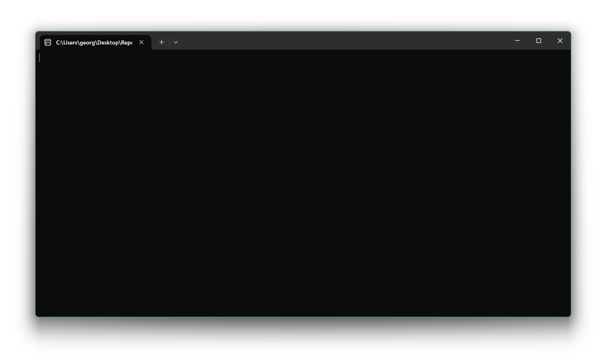
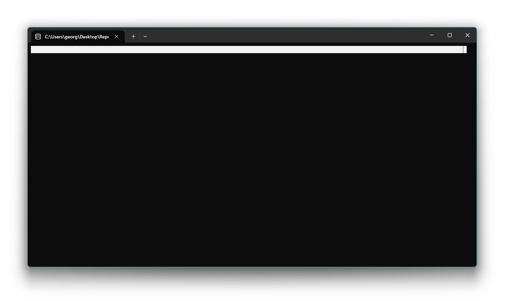
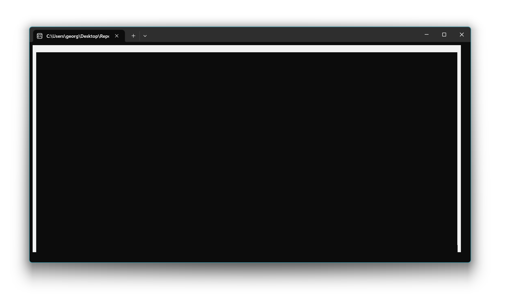
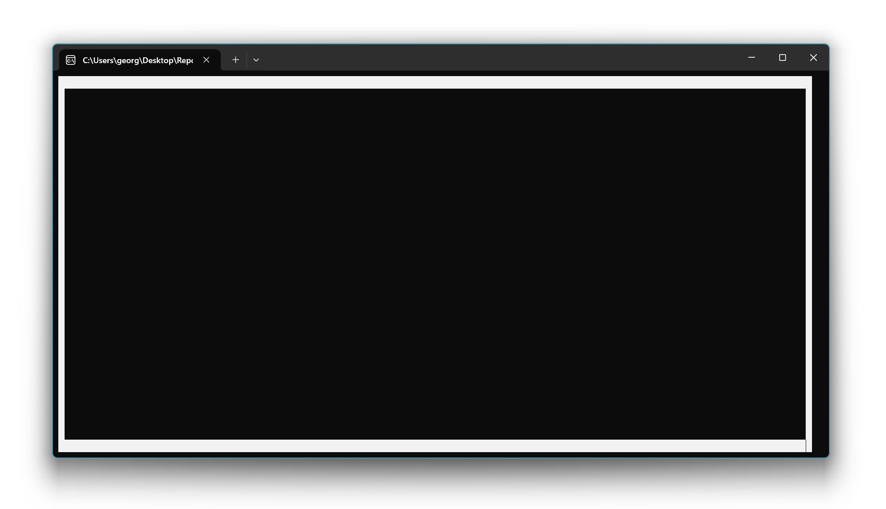
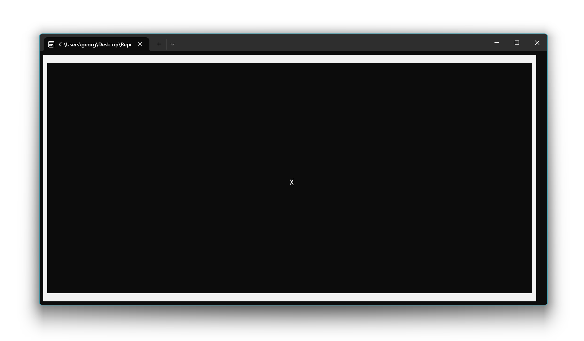

# 📖 Lesson 0: Console basics

In this lesson, you will learn the basics of console applications. You will learn how to clear the console, how to paint borders, and how to place a cursor at a specific position.

A console window can be seen as a grid of characters. The size of this grid is given by `Console.WindowWidth` and `Console.WindowHeight`. The position of each character is given by a column and a row, starting from (0, 0) in the top-left corner. The following image illustrates this.


The following C# code shows the basic structure of our program. The `Main` method is the entry point of our application. It contains three steps that we will implement: clearing the screen, painting the borders, and painting a pointer.

```csharp
namespace TerminalPaint {
    internal class Program {
        static void Main(string[] args) {
            // Step 1: Clear screen
            // Step 2: Paint borders
            // Step 3: Paint pointer
        }
    }
}
```

## Step 1: Clear screen

First, we want to start with a clean slate. We can clear the console window from any previous text by using the `Console.Clear()` method.

```csharp
Console.Clear();
```

After this line of code is executed, the console window will be empty, as shown in the screenshot below.



## Step 2: Paint borders

Next, we want to paint a border around the console window. We will use a white background color for the border. To do this, we set the `Console.BackgroundColor` to `ConsoleColor.White` and the `Console.ForegroundColor` to `ConsoleColor.Black`. This means that any text we write to the console from now on will have a white background and black text color. We use black as foreground color to make sure that any character that might be printed is visible on the white background.

```csharp
Console.BackgroundColor = ConsoleColor.White;
Console.ForegroundColor = ConsoleColor.Black;
```

We will paint the border in three steps: the top border, the left and right borders, and the bottom border.

```csharp
// Step 2.1: Paint top border
// Step 2.2: Paint left and right border
// Step 2.3: Paint bottom border
```

### Step 2.1: Paint top border

We start by painting the top border. First, we need to move the cursor to the top-left corner of the console window. The `Console.SetCursorPosition(0, 0)` method moves the cursor to column 0 and row 0.

```csharp
Console.SetCursorPosition(0, 0);
```

Then, we loop through all the columns of the console window and print a space character at each position. Since the background color is white, this will create a white line at the top of the console.

```csharp
for (int column = 0; column < Console.WindowWidth; column++)
{
    Console.Write(' ');
}
```

The result is a white bar at the top of the console.



### Step 2.2: Paint left and right border

Now, we paint the left and right borders. We do this for every row between the top and bottom borders. In each row, we print a space character at the first column (left border) and at the last column (right border). `Console.WindowWidth - 1` gives us the index of the last column.

```csharp
for (int row = 1; row < Console.WindowHeight - 1; row++)
{
    // Paint left border
    Console.SetCursorPosition(0, row);
    Console.Write(' ');

    // Paint right border
    Console.SetCursorPosition(Console.WindowWidth - 1, row);
    Console.Write(' ');
}
```

Now we have a border on the left and right side as well.



### Step 2.3: Paint bottom border

Finally, we paint the bottom border. We move the cursor to the beginning of the last row. `Console.SetCursorPosition(0, Console.WindowHeight - 1)` moves the cursor to the first column of the last row. `Console.WindowHeight - 1` gives us the index of the last row.

```csharp
Console.SetCursorPosition(0, Console.WindowHeight - 1);
```

Similar to the top border, we loop through all the columns and print a space character to draw the white bottom border.

```csharp
for (int column = 0; column < Console.WindowWidth; column++)
{
    Console.Write(' ');
}
```

With the bottom border in place, the frame is complete.



## Step 3: Paint pointer

As a final step, we want to paint a pointer in the center of the screen. We will use a black background and a white foreground color for the pointer to make it stand out from the white border.

```csharp
Console.BackgroundColor = ConsoleColor.Black;
Console.ForegroundColor = ConsoleColor.White;
```

We calculate the center of the console window by dividing the `Console.WindowWidth` and `Console.WindowHeight` by 2.

```csharp
int pointerX = Console.WindowWidth / 2;
int pointerY = Console.WindowHeight / 2;
```

We move the cursor to the calculated center position and print an 'X' character to represent our pointer.

```csharp
Console.SetCursorPosition(pointerX, pointerY);
Console.Write('X');
```

The final result is a console window with a border and a pointer in the middle.

