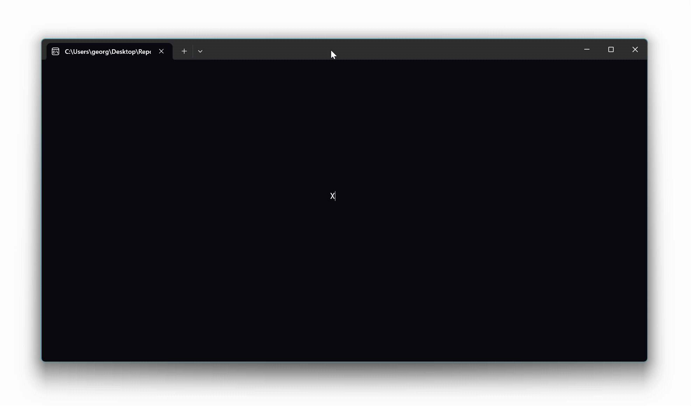

# 📖 Lesson 1: Pointer navigation

*This lesson is based on [Lesson 0: Console basics](../Lesson_00/README.md).*

TODO



TODO

```csharp
namespace TerminalPaint {
    internal class Program {
        static void Main(string[] args) {
            // PREVIOUS LESSON:

            // Step 1: Clear screen
            // Step 2: Paint borders

            // THIS LESSON:

            // Step 3: Initialize current pointer location
            // Step 4: Initialize previous pointer location
            // Step 5: Main loop
        }
    }
}
```

TODO

## Step 3: Initialize current pointer location

TODO

```csharp
// Note: pointerX and pointerY have been renamed!
int currentX = Console.WindowWidth / 2;
int currentY = Console.WindowHeight / 2;
```

## Step 4: Initialize previous pointer location

TODO

```csharp
int previousX = 0;
int previousY = 0;
```

## Step 5: Main loop

TODO

```csharp
while (true) {
    // Step 5.1: Clear previous pointer location
    // Step 5.2: Paint current pointer location
    // Step 5.3: Update previous pointer location
    // Step 5.4: Read and process next user input
}
```

TODO

### Step 5.1: Clear previous pointer location

TODO

```csharp
// Step 3.1
Console.SetCursorPosition(previousX, previousY);
Console.Write(' ');
```

### Step 5.2: Paint current pointer location

TODO

```csharp
Console.SetCursorPosition(currentX, currentY);
Console.Write('X');
```

### Step 5.3: Update previous pointer location

TODO

```csharp
previousX = currentX;
previousY = currentY;
```

### Step 5.4: Read and process next user input

TODO

```csharp
ConsoleKeyInfo input = Console.ReadKey(true);
```

TODO

```csharp
if (input.Key == ConsoleKey.UpArrow)
    // Case a: Move pointer up
else if (input.Key == ConsoleKey.DownArrow)
    // Case b: Move pointer down
else if (input.Key == ConsoleKey.LeftArrow)
    // Case c: Move pointer left
else if (input.Key == ConsoleKey.RightArrow)
    // Case d: Move pointer right
else if (input.Key == ConsoleKey.Escape)
    // Case e: Break main loop
else
    // Case f: Ignore input (and continue with next iteration)
```

TODO

#### Case a: Move pointer up

TODO

```csharp
// Case a
if (currentY > 1)
{
    currentY--;
}
```

#### Case b: Move pointer down

TODO

```csharp
// Case b
if (currentY < Console.WindowHeight - 2)
{
    currentY++;
}
```

#### Case c: Move pointer left

TODO

```csharp
// Case c
if (currentX > 1)
{
    currentX--;
}
```

#### Case d: Move pointer right

TODO

```csharp
// Case d
if (currentX < Console.WindowWidth - 2)
{
    currentX++;
}
```

#### Case e: Break main loop

TODO

```csharp
break;
```

#### Case f: Ignore input

TODO

```csharp
continue;
```