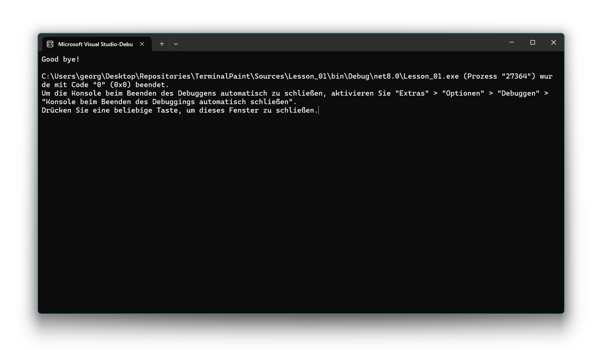

# 📖 Lesson 1: Pointer navigation

*This lesson is based on [Lesson 0: Console basics](../Lesson_00/README.md).*

In this lesson, we will learn how to create a movable pointer in our console application. This will be the first step towards creating a drawing application. We will use the arrow keys to move the pointer around the screen. The screencast below shows what the final result of this lesson will look like.


Let's get started! The following code shows the basic structure of our program. We will be adding code to the `Main` method to implement the pointer functionality. The comments outline the steps we will be taking.

```csharp
namespace TerminalPaint {
    internal class Program {
        static void Main(string[] args) {
            // PREVIOUS LESSON:

            // Step 1: Clear screen
            // Step 2: Paint borders

            // THIS LESSON:

            // Step 3: Initialize current pointer location
            // Step 4: Initialize previous pointer location
            // Step 5: Main loop
            // Step 6: Say goodbye
        }
    }
}
```

In the following, we explain Steps 3, 4, 5, and 6 in more detail.

## Step 3: Initialize current pointer location

Before we can move the pointer, we need to know where it is. We will use two integer variables, `currentX` and `currentY`, to store the horizontal and vertical coordinates of the pointer. To start, let's place the pointer in the center of the console window. We can get the window's width and height using `Console.WindowWidth` and `Console.WindowHeight`.

```csharp
// Note: pointerX and pointerY have been renamed!
int currentX = Console.WindowWidth / 2;
int currentY = Console.WindowHeight / 2;
```

## Step 4: Initialize previous pointer location

To create the illusion of a moving pointer, we need to erase the pointer from its old position before drawing it in the new one. To do this, we need to keep track of the pointer's previous location. We will use two more integer variables, `previousX` and `previousY`, for this purpose. We can initialize the previous location to any value that is inside of our drawing area, for example (1, 1).

```csharp
int previousX = 1;
int previousY = 1;
```

## Step 5: Main loop

Now for the core of our application: the main loop. This loop will run continuously, waiting for user input and updating the pointer's position accordingly. We use a `while (true)` loop to keep the application running until the user decides to exit. Inside the main loop, we will perform four main actions in each iteration:

```csharp
while (true) {
    // Step 5.1: Clear previous pointer location
    // Step 5.2: Paint current pointer location
    // Step 5.3: Update previous pointer location
    // Step 5.4: Read and process next user input
}
```

In the following, we explain Steps 5.1, 5.2, 5.3, and 5.4 in more detail.

### Step 5.1: Clear previous pointer location

First, we move the console's cursor to the previous location of the pointer using `Console.SetCursorPosition()`. Then, we write a space character (' ') to erase the 'X' that was there.

```csharp
Console.SetCursorPosition(previousX, previousY);
Console.Write(' ');
```

### Step 5.2: Paint current pointer location

Next, we move the cursor to the current pointer location and draw an 'X' to represent our pointer.

```csharp
Console.SetCursorPosition(currentX, currentY);
Console.Write('X');
```

### Step 5.3: Update previous pointer location

After drawing the pointer at its new position, we need to save these coordinates. We'll copy the values of `currentX` and `currentY` into `previousX` and `previousY`. This way, in the next loop iteration, we'll know where the pointer *was* so we can erase it.

```csharp
previousX = currentX;
previousY = currentY;
```

### Step 5.4: Read and process next user input

To get user input, we use `Console.ReadKey(true)`. This method waits for the user to press a key. The `true` argument tells the console not to display the pressed key, so our screen stays clean. The information about the pressed key is stored in the `input` variable.

```csharp
ConsoleKeyInfo input = Console.ReadKey(true);
```

After reading the user's input, we need to figure out which key was pressed and what to do. We use an `if-else if` statement to check the `Key` property of the `input` variable. We'll handle the four arrow keys to move the pointer, the Escape key to exit the program, and we'll ignore any other key.

```csharp
if (input.Key == ConsoleKey.UpArrow)
    // Case a: Move pointer up
else if (input.Key == ConsoleKey.DownArrow)
    // Case b: Move pointer down
else if (input.Key == ConsoleKey.LeftArrow)
    // Case c: Move pointer left
else if (input.Key == ConsoleKey.RightArrow)
    // Case d: Move pointer right
else if (input.Key == ConsoleKey.Escape)
    // Case e: Break main loop
else
    // Case f: Ignore input (and continue with next iteration)
```

In the following, we explain Case a, b, c, d, e, and f in more detail.

#### Case a: Move pointer up

If the user presses the up arrow, we want to move the pointer up. We do this by decreasing the `currentY` coordinate. We also add a check (`if (currentY > 1)`) to prevent the pointer from moving off the top edge of our drawing area (which is at Y-coordinate 1, because of the border).

```csharp
// Case a
if (currentY > 1)
{
    currentY--;
}
```

#### Case b: Move pointer down

When the down arrow is pressed, we increase the `currentY` coordinate. The `if (currentY < Console.WindowHeight - 2)` check prevents the pointer from moving past the bottom border.

```csharp
// Case b
if (currentY < Console.WindowHeight - 2)
{
    currentY++;
}
```

#### Case c: Move pointer left

For the left arrow, we decrease the `currentX` coordinate. The `if (currentX > 1)` check ensures the pointer stays within the left border.

```csharp
// Case c
if (currentX > 1)
{
    currentX--;
}
```

#### Case d: Move pointer right

For the right arrow, we increase the `currentX` coordinate. The `if (currentX < Console.WindowWidth - 2)` check keeps the pointer from crossing the right border.

```csharp
// Case d
if (currentX < Console.WindowWidth - 2)
{
    currentX++;
}
```

#### Case e: Break main loop

If the user presses the Escape key, we want to exit the application. The `break;` statement will terminate our `while (true)` loop, and the program will end.

```csharp
break;
```

#### Case f: Ignore input

If the user presses any other key, we don't want anything to happen. The `continue;` statement tells the loop to skip the rest of the current iteration and start again from the beginning.

```csharp
continue;
```
## Step 6: Say goodbye

After the user presses the Escape key, the main loop terminates, and the program proceeds to this final step. Before we exit, it's good practice to clean up the console. First, we'll reset the console's background and foreground colors to their default values. This ensures that the user's terminal is not left with the colors we used for the border.

```csharp
Console.BackgroundColor = ConsoleColor.Black;
Console.ForegroundColor = ConsoleColor.White;
```

Next, we clear the entire console window using `Console.Clear()`. This will remove the border we drew and any leftover 'X' from our pointer, leaving a clean screen.

```csharp
Console.Clear();
```

Finally, we print a friendly "Good bye!" message to the user to let them know the program has ended successfully.

```csharp
Console.WriteLine("Good bye!");
```

The screenshot below shows the final output. After you press Escape, the screen will be cleared, and you will only see the "Good bye!" message at the top of the console.

