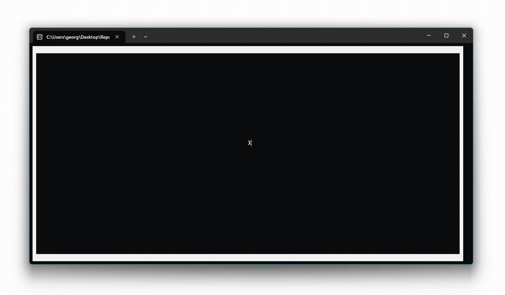

# 📖 Lesson 1: Pointer navigation

TODO

```csharp
// Step 1: Initialize current pointer location
// Step 2: Initialize previous pointer location
// Step 3: Read and process user inputs
```

TODO

```csharp
// Step 1
int currentX = Console.WindowWidth / 2;
int currentY = Console.WindowHeight / 2;
```

TODO

```csharp
// Step 2
int previousX = 0;
int previousY = 0;
```

TODO

```csharp
// Step 3
while (true) {
    // Step 3.1: Clear previous pointer location
    // Step 3.2: Paint current pointer location
    // Step 3.3: Update previous pointer location
    // Step 3.4: Read and process next user input
}
```

TODO

```csharp
// Step 3.1
Console.SetCursorPosition(previousX, previousY);
Console.Write(' ');
```

TODO

```csharp
// Step 3.2
Console.SetCursorPosition(currentX, currentY);
Console.Write('X');
```

TODO

```csharp
// Step 3.3
previousX = currentX;
previousY = currentY;
```

TODO

```csharp
// Step 3.4

// Step 3.4.1: Read input
ConsoleKeyInfo input = Console.ReadKey(true);
// Step 3.4.2: Process input
if (input.Key == ConsoleKey.UpArrow)
    // Case a: Move pointer up
else if (input.Key == ConsoleKey.DownArrow)
    // Case b: Move pointer down
else if (input.Key == ConsoleKey.LeftArrow)
    // Case c: Move pointer left
else if (input.Key == ConsoleKey.RightArrow)
    // Case d: Move pointer right
```

TODO

```csharp
// Case a
if (currentY > 0)
{
    currentY--;
}
```

TODO

```csharp
// Case b
if (currentY < Console.WindowHeight - 1)
{
    currentY++;
}
```

TODO

```csharp
// Case c
if (currentX > 0)
{
    currentX--;
}
```

TODO

```csharp
// Case d
if (currentX < Console.WindowWidth - 1)
{
    currentX++;
}
```

TODO

