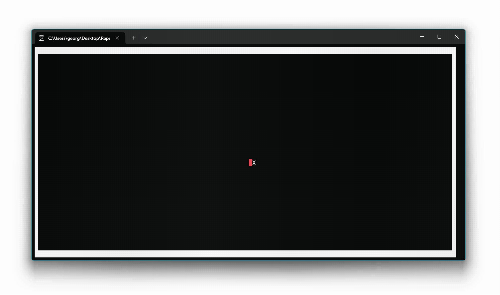

# 📖 Lesson 2: Image representation

*This lesson is based on [Lesson 1: Pointer navigation](../Lesson_01/README.md).*

In this lesson, TODO



The following code snippet TODO

```csharp
namespace TerminalPaint {
    internal class Program {
        static void Main(string[] args) {
            // PREVIOUS LESSON:

            // Step 1: Clear screen
            // Step 2: Paint borders
            // Step 3: Initialize current pointer location
            // Step 4: Initialize previous pointer location

            // THIS LESSON:

            // Step 5: Initialize image data
            // Step 6: Main loop (adapted!)

            // PREVIOUS LESSON:

            // Step 7: Say goodbye
        }
    }
}
```

In the following, we first TODO before TODO

## Step 5: Initialize image data

TODO


TODO

```csharp
int imageWidth = Console.WindowWidth - 2;
int imageHeight = Console.WindowHeight - 2;
```

TODO

```csharp
int imageSize = imageWidth * imageHeight;
```

TODO

```csharp
ConsoleColor[] imageData = ConsoleColor[imageSize];
```

TODO

```csharp
for (int pixel = 0; pixel < imageSize; pixel++) {
    imageData[pixel] = ConsoleColor.Black;
}
```

TODO


TODO

```csharp
int imageOffsetX = 1;
int imageOffsetY = 1;
```

## Step 6: Adapted main loop

The following code snippet TODO

```csharp
while (true)
{
    // THIS LESSON:

    // Step 6.1: Clear previous pointer location (adapted!)
    // Step 6.2: Paint current pointer location (adapted!)

    // PREVIOUS LESSON:

    // Step 6.3: Update previous pointer location

    // THIS LESSON:

    // Step 6.4: Read and process next user input (adapted!)
}
```

In the following, we first TODO before TODO

### Step 6.1: Clear previous pointer location

TODO


TODO

```csharp
Console.BackgroundColor = imageData[previousY * imageWidth + previousX];
Console.ForegroundColor = ConsoleColor.White;
```

TODO


TODO

```csharp
Console.SetCursorPosition(imageOffsetX + previousX, imageOffsetY + previousY);
Console.Write(' ');
```

### Step 6.2: Paint current pointer location

TODO

```csharp
Console.BackgroundColor = imageData[currentY * imageWidth + currentX];
Console.ForegroundColor = ConsoleColor.White;
```

TODO

```csharp
Console.SetCursorPosition(imageOffsetX + currentX, imageOffsetY + currentY);
Console.Write('X');
```

### Step 6.4: Read and process next user input

TODO

```csharp
ConsoleKeyInfo input = Console.ReadKey(true);
```

TODO

```csharp
if (input.Key == ConsoleKey.UpArrow)
    // Case a: Move pointer up
else if (input.Key == ConsoleKey.DownArrow)
    // Case b: Move pointer down
else if (input.Key == ConsoleKey.LeftArrow)
    // Case c: Move pointer left
else if (input.Key == ConsoleKey.RightArrow)
    // Case d: Move pointer right
else if (input.Key == ConsoleKey.Spacebar)
    // Case e: Update pixel color (NEW!!!)
else if (input.Key == ConsoleKey.Escape)
    // Case f: Break main loop
else
    // Case g: Ignore input
```

In the following, TODO

#### Case e: Update pixel color

TODO

```csharp
imageData[y * imageWidth + x] = ConsoleColor.Red;
```