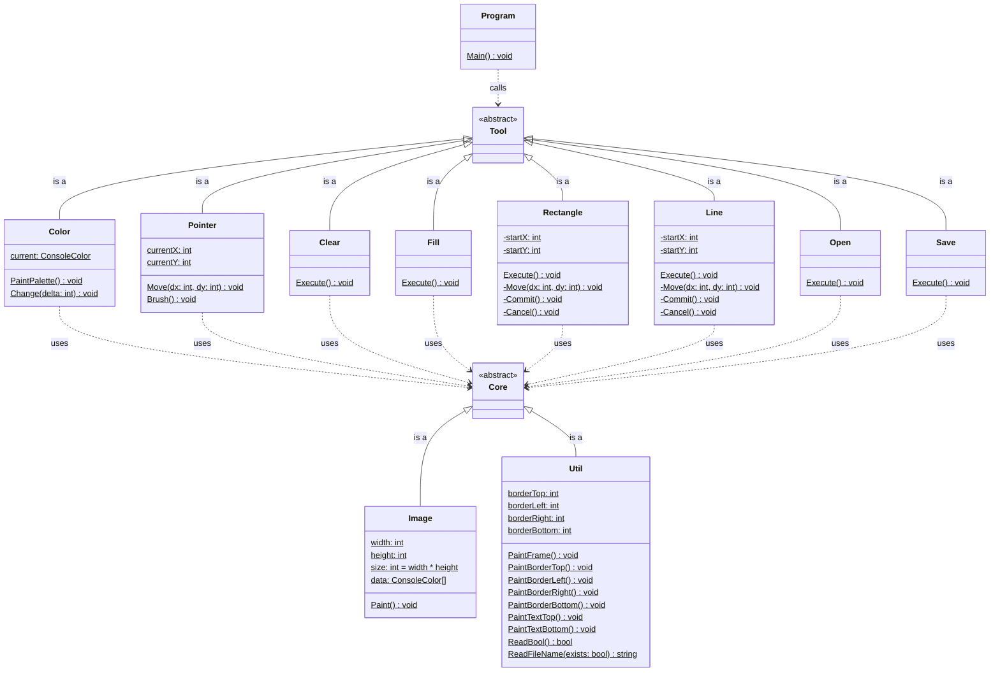

# 🖼️ TerminalPaint

**TerminalPaint** is a basic paint application running in the terminal.
The application features a color picker, rectangle and line drawing tools, as well as loading and saving of images.
The color picker provides access to a small palette of colors supported on a wide range of platforms (e.g. Windows, Linux, and MacOS).
The line drawing tool uses a simple implementation of the Bresenham algorithm for line discretization.
And image loading and saving uses a custom image format, which intentionally is not compatible with other tools.

We use this application for teaching programming at the [School of Engineering](https://fh-ooe.at/en/campus-wels) of the [University of Applied Sciences Upper Austria](https://fh-ooe.at/en).
According to our experience, the application is simple enough to be fully unterstood even by beginners, but interesting enough to motivate students to work on the assigments.

*Enjoy! 😉*

## Screencasts

Here are some screencasts showing **TerminalPaint** in action:

## Lessons

We use the **TerminalPaint** application to teach the following lessons:

- 📖 [**Lesson 0: Console basics**](./Lessons/Lesson_00/README.md) - Working with the *C# Console API*.
- 📖 [**Lesson 1: Pointer navigation**](./Lessons/Lesson_01//README.md) - Moving the pointer with the arrow keys.
- 📖 [**Lesson 2: Image representation**](./Lessons/Lesson_02/README.md) - Representing images in computer memory.
- 📖 [**Lesson 3: Color selection**](./Lessons/Lesson_03/README.md) - Implementing a color picking feature.
- 📖 [**Lesson 4: Clear operation**](./Lessons/Lesson_04/README.md) - Clearing the entire image.
- 📖 [**Lesson 5: Fill operation**](./Lessons/Lesson_05/README.md) - Filling image regions with a new color.
- 📖 [**Lesson 6: Rectangle operation**](./Lessons/Lesson_06/README.md) - Implementing a rectangle drawing tool.
- 📖 [**Lesson 7: Line operation**](./Lessons/Lesson_07/README.md) - Implementing a line drawing tool.
- 📖 [**Lesson 8: Storage operation**](./Lessons/Lesson_08/README.md) - Storing images to and loading images from disk.
- 📖 [**Lesson 9: Outlook**](./Lessons/Lesson_09/README.md) - Where you can go from here.

## Drawings

Here are some drawings made with **TerminalPaint**:

## Details

Here is an overview of the classes including their fields, methods, and dependencies:

## Documents

Finally, here are the standard documents shipped with open source software:

* 📄 [**LICENSE.md**](./LICENSE.md) - Explains the license of the source code.
* 📄 [**CHANGELOG.md**](./CHANGELOG.md) - Summarizes major changes to the source code.
* 📄 [**CONTRIBUTING.md**](./CONTRIBUTING.md) - Defines guidelines for contributing to the source code. 